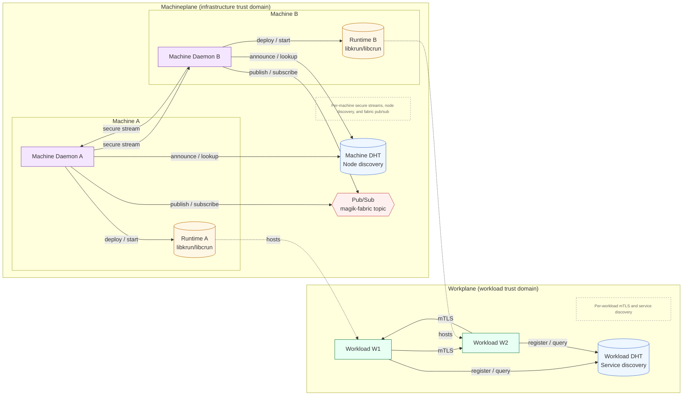

# **The Digital Sovereignty Fabric**

K8s API — **without** the hassle. Unleashed.

* No etcd, no control plane babysitting
* Machines are disposable; **state lives with the workload**
* End-to-end mTLS between machines *and* workloads by default  
* Designed for **tens of thousands of nodes**, partitions, and churn
  
> Just run, scale, enjoy!
> 
> **Magik** is a scale-out fabric that turns any device—cloud, on-prem, edge, or IoT—into an interchangeable compute resource.
> It scales out by eliminating the centralized control plane, enabling **secure, self-healing workloads** across highly dynamic environments.

[](https://www.rust-lang.org)
[](LICENSE)
[](https://crates.io/crates/korium)

-----

## **Table of Contents**

1. [Introduction](#1-introduction)
2. [Why Magik](#2-why-magik)
3. [Core Concept](#3-core-concept)
4. [How Magik Compares](#4-how-magik-compares)
5. [Architecture](#5-architecture)
6. [Quick Start](#6-quick-start)
7. [Use Cases](#7-use-cases)
8. [Summary](#8-summary)
9. [Comparison Matrix](#9-comparison-matrix)
10. [Specifications](#10-specifications)
11. [Community & Support](#11-community--support)

-----

## **1. Introduction**

Clouds and modern systems like Kubernetes are powerful but **inherently limited by centralization**. As these systems grow:

  * Control planes become **scaling bottlenecks**.
  * Consensus overhead increases.
  * Infrastructure failures ripple through workloads and disrupt our digital landscape.

Magik rethinks scale-out from the ground up:

  * **No global consensus**—fully scale-out fabric choreography.
  * **Consumer-aligned consistency**—each application carries its own state management.
  * **Scale out**—limited only by network capacity.

Magik starts from the assumption that everything is transient: identity, state, and trust. The system is therefore designed from the ground up for motion. Built-in self-healing, intelligent workload clustering, and mutual authentication with end-to-end encryption by design.

-----

## **2. Why Magik**

| Problem in Legacy Systems                                                | Magik Solution                                                                                                                                           |
| ------------------------------------------------------------------------ | ---------------------------------------------------------------------------------------------------------------------------------------------------------- |
| Scaling beyond thousands of nodes is hard due to control plane overhead. | **Fully decentralized choreography** instead of central orchestration.                                                                                     |
| Machine failures destabilize the control plane.                          | Machines are **fungible, disposable resources**; state lives **inside workloads**.                                                                         |
| High operational complexity (etcd, API servers, Raft quorums).           | **Single lightweight daemon** (50–80 MiB RAM).                                                                                                             |
| Weak identity and trust at scale.                                        | **Separate identities for machines and workloads**, with mutually authenticated streams.                                                                   |
| Vendor lock-in to specific clouds or infra.                              | **Infrastructure-agnostic**, runs on anything.                                                                                                             |
| Day-2 toil for upgrades/patching of control planes.                      | **Decoupled, autonomous Machineplane** → **rebuild > repair**, near-zero toil **as long as a bootstrap source (manifests/images or surviving workloads) exists**. |

-----

## **3. Core Concept**

### **3.1 Separation of Concerns**

CAP trade-offs are expressed as **A/P** (Availability + Partition Tolerance) and **C/P** (Consistency + Partition Tolerance).

| Concern       | Purpose                                                                                                                                                                                                  | CAP Trade-off                                  |
| ------------- | -------------------------------------------------------------------------------------------------------------------------------------------------------------------------------------------------------- | ---------------------------------------------- |
| **Machine**   | Node discovery and ephemeral tender negotiations; stores nothing. Machines are loosely coupled.                                                                                                            | **A/P** - Availability and Partition Tolerance |
| **Workload**  | Service discovery between workloads; maintains workload state and connectivity information. Workloads are loosely coupled to each other but tightly coherent internally, whether stateless or stateful. | **C/P** - Consistency and Partition Tolerance  |

> **Key benefit:** Machine failures do **not** pollute the workload. Each concern is isolated and optimized for its purpose, ensuring security, scalability, and reliability by design. This separation eliminates cross-cutting concerns and allows **each plane to optimize independently**. Scoping each plane to its domain prevents the monolithic anti-patterns that control-plane-centric platforms preserve.

-----

### **3.2 Consumer-Scoped Consistency**

Traditional cloud or orchestration systems stitch **infrastructure to clusters** and make the platform expensive and static, tying up a lot of operational resources by design.

**Magik flips the model:**

  * **Infrastructure is stateless**, ephemeral, and disposable by design.
  * Each **stateful workload carries its own consensus** (e.g., Raft for databases).

> Machine failures never corrupt workloads, and the architecture enables scale-out to **thousands of nodes**.  
> Additionally, operational effort is reduced to near zero.

-----

### **3.3 Security Model**

Magik assigns transient and **separate cryptographic identities** to machines and workloads, and all communication in Magik is **mutually authenticated** and **end-to-end encrypted** using mutually authenticated, encrypted streams by design:

| Entity       | Identity Details                                                                                                                                                                                                                                |
| ------------ | ----------------------------------------------------------------------------------------------------------------------------------------------------------------------------------------------------------------------------------------------- |
| **Machine**  | Each machine has a **unique cryptographic identity** generated at initialization, backed by an Ed25519 key pair, and used for node discovery, scheduling, and secure, mutually authenticated, encrypted machine-to-machine communication. |
| **Workload** | Each workload has a **unique cryptographic identity**, backed by a separate Ed25519 key pair, and used only for service discovery and secure, mutually authenticated, encrypted workload-to-workload communication.                      |

  * This separation ensures **complete isolation of trust boundaries** between infrastructure and workloads, implementing zero trust at the core by design.
  * Machine and workload communication **never share credentials**.
  * Even if a machine is compromised, workloads remain isolated and protected.

-----

## **4. How Magik Compares**

| System      | Control Plane                   | Scaling Limit                | State Model                         | Notes                                       |
| ----------- | ------------------------------- | ---------------------------- | ----------------------------------- | ------------------------------------------- |
| Kubernetes  | Centralized (etcd + API server) | ~5,000 nodes / 150,000 pods  | Strong consistency cluster-wide     | Rich ecosystem but control-plane limited    |
| Nomad       | Centralized Raft quorum         | Thousands of nodes           | Strong consistency global scheduler | Lighter than K8s but still infra-bound      |
| Swarm       | Raft manager nodes              | ~1,000 nodes                 | Strong consistency cluster-wide     | Simple but infra-coupled                    |
| **Magik** | **None—scale-out fabric**       | **Tens of thousands+**       | **Consistency scoped to workload**  | Scale-out; only stateful workloads run Raft |

-----

## **5. Architecture**

### **5.1 High-Level Diagram**



---

### **5.2 Machineplane**

The **Machineplane** manages infrastructure resources and scheduling, with **no persistent state**. It is **disposable, fully decoupled, and autonomous**—rebuild at will **as long as you have some bootstrap source (e.g., registries, manifests, or surviving workloads) to repopulate the fabric**.

#### **Implementation**

The machineplane is implemented in Rust using Korium for peer-to-peer networking:

| Module | Description |
|--------|-------------|
| `network.rs` | Korium networking (Gossipsub + Kademlia DHT + Request-Response over QUIC) |
| `scheduler.rs` | Tender/Bid/Award scheduling logic with replay protection |
| `messages.rs` | Wire protocol message definitions, signature types (bincode serialization) |
| `runtime.rs` | Runtime engine orchestration, isolation mode selection, manifest processing |
| `runtimes/krun.rs` | KrunEngine - microVM isolation via libkrun (default) |
| `runtimes/crun.rs` | CrunEngine - container isolation via libcrun (IoT/edge, Wasm support) |
| `api.rs` | REST API with Kubernetes compatibility |

#### **Responsibilities**

* Node discovery via **Machine DHT** (Kademlia).
* Decentralized workload scheduling using ephemeral tender negotiations.
* Fabric-level coordination through secure, mutually authenticated streams.
* Resource offering and bidding, capability advertisement, and local policy enforcement.
* Workload isolation via **microVM** (KrunEngine/libkrun, default) or **container** (CrunEngine/libcrun for IoT/edge).
* **First-class WebAssembly support** via CrunEngine (wasmedge/wasmtime OCI handlers).
* Lifecycle hooks to start and stop workloads via the runtime.

> **Operational impact:** no etcd, no API servers, no manager quorum, no backups—**near-zero operational toll.**

---

### **5.3 Ephemeral Scheduling Process**

Traditional schedulers maintain global fabric state and enforce consensus (Raft, etcd), creating bottlenecks. Magik uses **ephemeral scheduling**: **tenders are never persisted**, and scheduling happens dynamically across the scale-out fabric. 

#### **Advantages of Ephemeral Scheduling**

| Advantage                      | Why It Matters                                                                                          |
| ------------------------------ | ------------------------------------------------------------------------------------------------------- |
| **No single point of failure** | No central scheduler to crash or be partitioned.                                                        |
| **Low coordination overhead**  | Tenders are transient and do not require consensus.                                                       |
| **Partition tolerance**        | Nodes continue to schedule independently during network splits.                                         |
| **High throughput**            | Scales naturally with node count.                                                                       |
| **Thundering herd mitigation** | Only nodes that match placement and resource criteria bid, so reply volume stays bounded even at scale. |

---

### **5.4 Machine-to-Machine Security**

* Each machine verifies scheduling message authenticity using **Ed25519 signatures**.
* All communications are encrypted and mutually authenticated using **QUIC transport with TLS 1.3**.
* Replay protection via `(timestamp, nonce)` tuples with ±30 second clock skew tolerance.
* Rogue nodes cannot influence scheduling without a valid cryptographic identity.

---

### **5.5 Workplane**

The **Workplane** runs as the **infra container** in every Pod (replacing the standard pause container), providing per-workload service discovery and self-healing.

#### **Implementation**

| Module | Description |
|--------|-------------|
| `agent.rs` | Main agent orchestrator and lifecycle management |
| `network.rs` | Korium networking (Kademlia DHT + Request-Response RPC over QUIC) |
| `discovery.rs` | In-memory WDHT cache with TTL-based expiration and conflict resolution |
| `raft.rs` | Simplified Raft for leader election (stateful workloads only) |
| `selfheal.rs` | Replica management and health probing |
| `rpc.rs` | RPC request/response types |
| `config.rs` | Environment-based configuration |
| `metrics.rs` | Lightweight metrics collection (counters and gauges) |
| `supervisor.rs` | Init supervisor for microVM mode (PID 1, signal forwarding, zombie reaping) |

#### **Functions**

| Function              | Description                                                                                                                                                                                                       |
| --------------------- | ----------------------------------------------------------------------------------------------------------------------------------------------------------------------------------------------------------------- |
| **Self-Healing**      | Monitors desired replica counts and autonomously spawns replacements using local manifest data. Replica counts are treated as **"at least"** targets; the Machineplane may temporarily run extra replicas safely. |
| **Service Discovery** | Registers workloads in the **Workload DHT** for peer lookup and routing via `ServiceRecord` entries with TTL.                                                                                                    |
| **Secure Networking** | Pod-to-pod traffic flows through mutually authenticated, encrypted streams using Korium's QUIC transport.                                                                                                                    |
| **Leader Election**   | For **stateful workloads** (StatefulSets), Raft consensus ensures leader-only writes and minority partition refusal.                                                                                              |

#### **Workload-to-Workload Security**

* Each Pod uses a **unique Workload Peer ID** (Ed25519).
* Secure communication is **independent** of machine identities (separate trust domains).
* Prevents cross-plane privilege escalation.

---

## **6. Quick Start**

### **Prerequisites**

* Rust 1.85+ (`rustup update stable`) — Edition 2024 required
* **Runtime Libraries** (for actual workload execution):
  * **Linux:** libkrun 1.10+ (microVM via KVM) and/or libcrun 1.8+ (container for IoT)
  * **macOS:** libkrun 1.16+ and libkrunfw 4.10+ (microVM via HVF)

> **Note:** The codebase compiles on all platforms. Runtime engines use stubs on unsupported platforms, returning "unavailable" at runtime. This enables unified development and CI across Linux, macOS, and other systems.

#### **macOS Development Setup**

```bash
# Install libkrun and libkrunfw (uses Apple Hypervisor Framework)
brew tap slp/krun
brew install slp/krun/libkrun slp/krun/libkrunfw

# Install LLVM (required for build-time FFI generation)
brew install llvm

# Create libkrunfw version symlink (libkrun expects v5, brew installs v4)
sudo ln -sf /opt/homebrew/lib/libkrunfw.4.dylib /opt/homebrew/lib/libkrunfw.5.dylib

# Set environment for build
export LIBCLANG_PATH=/opt/homebrew/opt/llvm/lib
export LIBRARY_PATH=/opt/homebrew/lib:$LIBRARY_PATH
export DYLD_LIBRARY_PATH=/opt/homebrew/lib:$DYLD_LIBRARY_PATH
```

#### **macOS Hypervisor Entitlement**

macOS requires the `com.apple.security.hypervisor` entitlement for HVF access. Binaries must be signed with this entitlement to create VMs:

```bash
# Sign the machineplane binary
codesign --force --sign - --entitlements machineplane/entitlements.plist target/release/machineplane

# For tests: find and sign the test binary (exclude .d metadata files)
TEST_BIN=$(find target/release/deps -name 'apply_tests-*' -type f ! -name '*.d')
codesign --force --sign - --entitlements machineplane/entitlements.plist "$TEST_BIN"

# Run tests with VM support
MAGIK_FORCE_VM_TESTS=1 DYLD_LIBRARY_PATH=/opt/homebrew/lib "$TEST_BIN" <test_name> --nocapture
```

> **For development:** After each build, re-sign the binary before running. The entitlements.plist file is included in the repository.

#### **Runtime Availability**

| Platform | KrunEngine (microVM) | CrunEngine (container) |
|----------|---------------------|------------------------|
| Linux    | ✅ via KVM          | ✅ via namespaces/cgroups |
| macOS    | ✅ via HVF          | ❌ (stub - unavailable) |
| Other    | ❌ (stub)           | ❌ (stub) |

### **Build**

```bash
# Clone the repository
git clone https://github.com/magik/magik.git
cd magik

# Build all components (development)
cargo build --release
```

#### **Production Build with Embedded Workplane**

For production deployments, the workplane binary must be statically linked and embedded into machineplane:

```bash
# Install musl target for static linking
rustup target add x86_64-unknown-linux-musl

# On macOS: install musl cross-compiler
brew install FiloSottile/musl-cross/musl-cross

# Build workplane as static binary for containers
cargo build -p workplane --release --target x86_64-unknown-linux-musl

# Rebuild machineplane (automatically embeds workplane via build.rs)
cargo build -p machineplane --release
```

This creates a self-contained machineplane that:
- Extracts the embedded workplane binary at startup
- Creates a minimal OCI image (`localhost/magik/workplane:latest`)
- Uses it as the infra container for all pods (replacing pause)

### **Run the Machineplane Daemon**

```bash
# Start a single node (uses libkrun by default)
./target/release/machineplane

# Start with explicit configuration
./target/release/machineplane \
  --rest-api-port 3000 \
  --korium-port 4001 \
  --bootstrap-peer "<identity_hex>@<ip:port>"
```

#### **Machineplane CLI Options**

| Option | Default | Description |
|--------|---------|-------------|
| `--rest-api-host` | `0.0.0.0` | Host address for REST API |
| `--rest-api-port` | `3000` | Port for REST API |
| `--node-name` | (none) | Optional human-readable node name |
| `--runtime` | `krun` | Runtime engine: `krun` (microVM) or `crun` (container) |
| `--korium-port` | `0` (auto) | Port for Korium mesh networking |
| `--korium-host` | `0.0.0.0` | Host for Korium listeners |
| `--bootstrap-peer` | (none) | Bootstrap peer in format `<identity_hex>@<ip:port>` (repeatable) |
| `--dht-refresh-interval-secs` | `60` | DHT presence refresh interval |
| `--ephemeral-keys` | `false` | Use ephemeral keys (no disk persistence) |
| `--signing-ephemeral` | `false` | Use ephemeral Ed25519 signing keys |
| `--kem-ephemeral` | `false` | Use ephemeral KEM keys for encryption |

### **Workplane Agent (Automatic)**

The workplane agent runs automatically as the **infra container** in every pod deployed by machineplane. No manual invocation is required.

When machineplane deploys a manifest, it:
1. Uses `localhost/magik/workplane:latest` as the pod's infra container
2. Passes workload identity via command-line arguments
3. The agent provides mesh networking, service discovery, and self-healing

For manual testing or development, you can run the workplane binary directly:

```bash
./target/release/workplane \
  --namespace default \
  --workload nginx \
  --pod nginx-0 \
  --workload-kind Deployment \
  --replicas 3 \
  --liveness-url http://127.0.0.1:8080/health \
  --readiness-url http://127.0.0.1:8080/ready \
  --privkey $BEE_PRIVATE_KEY_B64
```

#### **Workplane CLI Options and Environment Variables**

| CLI Option | Environment Variable | Description | Default |
|------------|---------------------|-------------|---------|
| `--namespace` | `BEE_NAMESPACE` | Kubernetes namespace | `default` |
| `--workload` | `BEE_WORKLOAD_NAME` | Workload name | Required |
| `--pod` | `BEE_POD_NAME` | Pod name | Required |
| `--workload-kind` | `BEE_WORKLOAD_KIND` | `Deployment` or `StatefulSet` | `Deployment` |
| `--replicas` | `BEE_REPLICAS` | Desired replica count | `1` |
| `--liveness-url` | `BEE_LIVENESS_URL` | HTTP liveness probe URL | None |
| `--readiness-url` | `BEE_READINESS_URL` | HTTP readiness probe URL | None |
| `--machine-api` | `BEE_MACHINE_API` | Machineplane API URL | `http://localhost:8080` |
| `--privkey` | `BEE_PRIVATE_KEY_B64` | Base64-encoded Ed25519 private key | Required |
| `--bootstrap-peers` | `BEE_BOOTSTRAP_PEERS` | Comma-separated bootstrap peer addresses | None |
| `--listen-addrs` | `BEE_LISTEN_ADDRS` | Comma-separated listen addresses | None |
| `--allow-workloads` | `BEE_ALLOW_WORKLOADS` | Comma-separated allowed workload patterns | None |
| `--deny-workloads` | `BEE_DENY_WORKLOADS` | Comma-separated denied workload patterns | None |
| `--allow-cross-namespace` | `BEE_ALLOW_CROSS_NAMESPACE` | Allow cross-namespace discovery | `false` |
| `--dht-ttl-secs` | `BEE_DHT_TTL_SECS` | WDHT record TTL | `15` |
| `--dht-heartbeat-secs` | `BEE_DHT_HEARTBEAT_SECS` | DHT heartbeat announcement interval | `5` |
| `--health-interval-secs` | `BEE_HEALTH_INTERVAL_SECS` | Health check interval | `10` |
| `--health-timeout-secs` | `BEE_HEALTH_TIMEOUT_SECS` | Health check timeout | `5` |
| `--replica-check-interval-secs` | `BEE_REPLICA_CHECK_INTERVAL_SECS` | Reconciliation interval | `30` |

### **Deploy a Workload (kubectl-compatible)**

```bash
# Create a deployment
curl -X POST http://localhost:3000/apis/apps/v1/namespaces/default/deployments \
  -H "Content-Type: application/yaml" \
  -d @nginx-deployment.yaml

# List deployments
curl http://localhost:3000/apis/apps/v1/namespaces/default/deployments

# List pods
curl http://localhost:3000/api/v1/namespaces/default/pods

# Delete a deployment
curl -X DELETE http://localhost:3000/apis/apps/v1/namespaces/default/deployments/nginx
```

---

## **7. Use Cases**

| Scenario                     | Why Magik Works                                                             |
| ---------------------------- | ----------------------------------------------------------------------------- |
| **Edge & IoT Networks**      | Operates in unreliable, partitioned networks with minimal resources.          |
| **Multicloud Microservices** | One service mesh across on-prem + Azure + AWS + GCP—no vendor lock-in.        |
| **Global Analytics/Batch**   | Elastic bursts across providers; ephemeral scheduling matches queue spikes.   |
| **Smart Cities / Telco**     | Millions of devices with frequent churn; the Machineplane is throwaway.       |
| **Enterprise Databases**     | State lives with the workload's own quorum; infra failures do not corrupt it. |
| **Air-Gapped IT/OT**         | Full functionality inside isolated networks; optional selective sync.         |
| **Enterprise Workloads**     | Strong, consistent, reliable on-prem and multicloud behaviors by design.      |

---

## **8. Summary**

Magik represents a **paradigm shift** in orchestration:

* Eliminates centralized control planes and scaling bottlenecks.
* Uses **ephemeral, decentralized scheduling** for effectively unparalleled scalability.
* Provides **strict isolation** between infrastructure and workloads.
* Ensures **all communications are mutually authenticated and encrypted**.
* Scales to **tens of thousands of nodes**, ideal for edge, IoT, cloud, **multicloud**, and **air-gapped** environments.
* A **disposable, fully decoupled Machineplane** enables autonomous, low-toil operations.

> **Magik is not just another orchestration system—it is a secure, scale-out choreography fabric for the future of global computing.**

---

## **9. Comparison Matrix**

> *Note on "Mutually Authenticated Streams": legacy systems may add this via optional plugins or sidecars, but it is **not** default fabric behavior.*

| Feature                                 | Kubernetes        | Nomad             | **Magik**                 |
| --------------------------------------- | ----------------- | ----------------- | --------------------------- |
| Central Control Plane                   | Yes               | Yes               | **No**                      |
| Separate Machine & Workload DHTs        | No                | No                | **Yes**                     |
| Unique Peer IDs per Machine             | No                | No                | **Yes**                     |
| Unique Peer IDs per Workload            | No                | No                | **Yes**                     |
| Mutually Authenticated Machine Streams  | Optional (addons) | Optional (addons) | **Yes (default)**           |
| Mutually Authenticated Workload Streams | Optional (addons) | Optional (addons) | **Yes (default)**           |
| Global Consensus Required               | Yes               | Yes               | **No**                      |
| Scalability Ceiling                     | ~5,000 nodes      | ~10,000 nodes     | **Tens of thousands+**      |
| IoT Suitability                         | Medium            | Medium            | **Excellent**               |
| Edge Suitability                        | Medium            | Medium            | **Excellent**               |
| Enterprise Suitability                  | Excellent         | Excellent         | **Excellent (+air-gapped)** |

---

## **10. Specifications**

For full normative details, see:

* **Technical Specification**: [`technical-spec.md`](./technical-spec.md)  
  Comprehensive technical details including data structures, wire protocols, and API reference.

* **Machineplane Spec**: [`machineplane/machineplane-spec.md`](./machineplane/machineplane-spec.md)  
  Node discovery, ephemeral scheduling, deployment, security, failure handling, and observability.

* **Workplane Spec**: [`workplane/workplane-spec.md`](./workplane/workplane-spec.md)  
  Per-workload service discovery, workload identity, secure workload-to-workload connectivity, self-healing, and consistency gating.

### **Technology Stack**

| Component | Technology | Version |
|-----------|------------|---------|
| Language | Rust | 2024 Edition |
| Networking | Korium | 0.4.6 |
| Transport | QUIC | via Korium |
| DHT | Kademlia | via Korium |
| Pub/Sub | Gossipsub | via Korium |
| Serialization | bincode + serde | 1.3 / 1.0 |
| Container Runtime | libcrun | 1.8+ (Linux only, IoT/edge) |
| MicroVM Runtime | libkrun | 1.10+ (Linux KVM, macOS HVF) |
| Wasm Runtime | wasmedge/wasmtime | via libcrun |
| REST Framework | axum | 0.8 |

---

## **11. Community & Support**

* **GitHub**: [github.com/magik/magik](https://github.com/magik/magik)
* **Documentation**: [docs.magik.io](https://docs.magik.io)
* **License**: Apache 2.0
