# **Magik Machineplane — Normative Specification (v0.4)**

> Scope: This document specifies the **Machineplane** of Magik: node discovery, ephemeral scheduling, deployment, security, failure handling, and observability. It uses RFC 2119 keywords and provides executable-style Gherkin scenarios.
> **Profile:** Rust implementation using `Korium` (Kademlia DHT + Gossipsub + Request-Response + QUIC).
> **Semantics:** Machineplane scheduling is **best-effort with deterministic winner selection (A/P)**. **Consistency for stateful workloads is enforced by the Workplane (C/P).**

-----

## **1. Overview & Goals**

The Machineplane is a **stateless, decentralized infrastructure layer** that turns machines into fungible resources. It coordinates **node discovery, ephemeral scheduling, and workload deployment** using `Korium` primitives (**DHT + Pub/Sub + secure streams**). It **MUST NOT** persist fabric-wide state and **MUST** operate under **Availability/Partition-Tolerance (A/P)** tradeoffs.

**Scheduling semantics:** Elections on the Machineplane are **hint-based**; **multiple concurrent lease hints MAY occur**. The Machineplane provides **at-least-once scheduling with deterministic winner sets**, and the **Workplane** enforces leadership and write safety for stateful workloads.

### **1.1 Non-Goals**

  * Application service discovery and pod-to-pod overlay networking (**Workplane** responsibility).
  * Workload state/consensus (carried by workloads/Workplane).

### **1.2 Glossary (selected)**

  * **MDHT**: Machine DHT (Korium Kademlia).
  * **Tender**: Scheduling intent to run a workload.
  * **Bid**: A machine’s proposal to run a Tender.

-----

## **2. Architecture**

### **2.1 Components**

  * **Machine Daemon (Rust)**: single lightweight process per node (50–80 MiB RAM). It **MAY** be packaged and run as an OCI **container**; when containerized it **MUST**:

      * have access to hypervisor capabilities (KVM on Linux, Hypervisor.framework on macOS),
      * provide networking suitable for Korium inbound/outbound (host networking **RECOMMENDED**; otherwise expose ports),
      * have permissions to manage microVMs via libkrun,
      * **NOT** mount workload credentials; machine and workload identities stay disjoint.

  * **Machine DHT (MDHT)**: node discovery and transient machine metadata.

  * **Pub/Sub Topic (Gossipsub)**: `magik-fabric` — shared topic used **only for tender publication**.
      * Tender payloads **MUST** be bincode-encoded `Tender` structs.
      * Bids, Awards, and Events **MUST NOT** be published to gossipsub topics.

  * **Request-Response Protocol**: Point-to-point messaging for scheduling negotiation.
      * **Bids**: Sent directly from bidder to tender owner.
      * **Awards** (with manifest): Sent directly from tender owner to each winner.
      * **Events**: Sent directly from winner back to tender owner.
      * All request-response payloads **MUST** be bincode-encoded and signed.

  * **Secure Streams**: bilateral encrypted channels (mTLS) underlying all communication.

  * **Runtime Adapter**: workload isolation via configurable engines:
      * **KrunEngine** (default): Hardware-isolated microVMs (KVM on Linux, Hypervisor.framework on macOS Apple Silicon)
      * **CrunEngine**: Container isolation via crun (OCI runtime for IoT/embedded devices)

### **2.2 Data Isolation**

  * MDHT **MUST** store **only minimal, transient** machine metadata.
  * Workload DHT **MUST NOT** contain any machine-level data.

### **2.3 Diagrams**

```mermaid
sequenceDiagram
  autonumber
  participant P as Producer (kubectl/controller)
  participant N1 as Node A
  participant N2 as Node B
  participant R as Runtime (libkrun)
  participant PubSub as Pub/Sub

  P->>PubSub: Publish Tender(tender_id, reqs, qos, manifest_digest)
  Note over N1,N2: All nodes receive tender via Pub/Sub (manifest stays with Producer)

  N1->>N1: Local Evaluate(reqs, policies)
  N2->>N2: Local Evaluate(reqs, policies)

  N1->>P: Direct: Bid(tender_id, node_id, score, fit, latency)
  N2->>P: Direct: Bid(tender_id, node_id, score, fit, latency)

  P->>P: Collect bids within window (~250ms ± jitter)
  P->>P: Select winners deterministically

  P->>N1: Direct: Award + Manifest (if N1 is winner)
  P->>N2: Direct: Award + Manifest (if N2 is winner)

  alt Awarded and manifest received
    N1->>R: Deploy(manifest)
    R-->>N1: Deployment Result (OK / Failed)
    N1->>P: Direct: Event(tender_id, status=Deployed|Failed)
  end

  Note over P: Scheduling context discarded after all events received or timeout
```




---

## **3. Protocols & Data Models**

### **3.1 Identifiers**

* **Machine Peer ID**: Korium peer ID (hex-encoded). **MUST** be unique per machine. Generated ephemeral Ed25519 keypair on each daemon start.
* **Tender ID**: UUID v4 string. **MUST** be globally unique for de-duplication.
* **Pod ID**: UUID v4 string. **MUST** be unique per pod instance. Used as `magik.pod_id` label.
* **Resource ID**: Unique identifier for a deployed resource, format: `{namespace}/{kind}/{name}` (for example, `default/Deployment/nginx`). This aligns with Kubernetes resource coordinates and the Workplane's workload identification scheme. Used for DISPOSAL targeting and workload identity.

### **3.2 Message Schemas (Korium-secured binary payloads)**

All inter-node communication uses **bincode-encoded Rust structs** transported over
Korium **mTLS** streams. No additional envelope or per-message encryption layer
is required because Korium sessions are already mutually authenticated and encrypted.

#### **3.2.1 Tender (Gossipsub broadcast)**

Published to `magik-fabric` topic. Contains:

* `id`: UUID v4 (globally unique tender identifier)
* `manifest_digest`: reference digest (currently uses tender_id as placeholder)
* `qos_preemptible`: boolean flag for preemption eligibility
* `timestamp`: u64 (ms since UNIX epoch)
* `nonce`: u64 (unique per tender for replay protection)
* `signature`: Ed25519 signature bytes (by tender owner)

The tender owner's PeerId is available from the gossipsub message `source` field (guaranteed present when using `MessageAuthenticity::Signed`).

**Replica count is not disclosed**; the publisher decides how many bids to accept.

#### **3.2.2 Bid (Request-Response to tender owner)**

Sent directly to the tender owner (identified from gossipsub message source). Contains:

* `tender_id`: UUID v4 referencing the tender
* `node_id`: PeerId of the bidding node
* `score`: f64 composite score
* `resource_fit_score`: f64
* `network_locality_score`: f64
* `timestamp`: u64 (ms since UNIX epoch)
* `nonce`: u64 (unique per bid for replay protection)
* `signature`: Ed25519 signature bytes (by bidder)

#### **3.2.3 Award (Request-Response to winners, includes manifest)**

Sent directly from tender owner to each winning node. Contains:

* `tender_id`: UUID v4
* `manifest_json`: the actual manifest content (full JSON/YAML string)
* `owner_peer_id`: PeerId of tender owner (for event responses)
* `owner_pubkey`: public key bytes (for authorization and signature verification)
* `replicas`: u32 (number of replicas this node should run, typically 1)
* `timestamp`: u64 (ms since UNIX epoch)
* `nonce`: u64
* `signature`: Ed25519 signature bytes (by tender owner, covers manifest_json)

**Integrity Verification**: The signature covers `manifest_json`, so any tampering would 
invalidate the signature. The manifest digest can be computed by the receiver as SHA256(manifest_json) for verification against the tender's `manifest_digest` field.

#### **3.2.4 Event (Request-Response to tender owner)**

Sent directly from winner back to tender owner after deployment attempt. Contains:

* `tender_id`: UUID v4
* `node_id`: PeerId of the reporting node
* `event_type`: enum {Deployed=0, Failed=1, Preempted=2, Cancelled=3}
* `reason`: string description
* `timestamp`: u64 (ms since UNIX epoch)
* `nonce`: u64
* `signature`: Ed25519 signature bytes (by reporter)

#### **3.2.5 Disposal (Gossipsub broadcast)**

Published to `magik-fabric` topic to request deletion of a deployed resource. Contains:

* `namespace`: string (Kubernetes namespace, e.g., "default")
* `kind`: string (resource kind, e.g., "Deployment", "Pod", "StatefulSet")
* `name`: string (resource name from metadata.name)
* `timestamp`: u64 (ms since UNIX epoch)
* `nonce`: u64 (unique per disposal for replay protection)
* `signature`: Ed25519 signature bytes (by disposal requester)

The resource is identified by coordinates `{namespace}/{kind}/{name}` (Resource ID). Nodes receiving a Disposal **MUST**:

1. Verify the signature against the source peer's public key
2. Verify timestamp freshness (within ±30 seconds)
3. Add the Resource ID to the local DISPOSAL_SET with a 5-minute TTL
4. Delete any local pods matching all three coordinates (namespace, kind, name)

This is a **fire-and-forget** operation; no response is expected. The DISPOSAL_SET prevents the self-healer from recovering pods that are intentionally being deleted.

#### **3.2.6 Scheduling Lifecycle**

The scheduling context is **ephemeral**:

1. Tender owner creates context upon publishing tender
2. Context tracks: received bids, awarded winners, expected events
3. Context terminates when:
   - All winners report `Deployed` or `Failed` events
   - `deploy_timeout_ms` expires without all expected events
   - Tender is explicitly cancelled
4. Upon termination, all scheduling state for that tender is discarded

**Existing messages** (`ApplyRequest/Response`, `DeleteRequest/Response`) stay as in v0.2,
but are encoded directly with bincode without an envelope wrapper.

### **3.3 Cryptography**

* All messages **MUST** be signed by the sender's **Machine Peer ID** key (Ed25519).
* All streams **MUST** use `Korium` **QUIC** transport with built-in TLS 1.3 encryption and mutual authentication.
* Messages **MUST** include `timestamp` and `nonce` for replay mitigation.
* Receivers **MUST** reject messages with clock skew > **±30 seconds** (`MAX_CLOCK_SKEW_MS = 30000`).
* Receivers **MUST** reject duplicate `(tender_id, node_id, nonce)` tuples within the **5-minute replay window** (`REPLAY_WINDOW_MS = 300000`).
* Signature verification **MUST** use the public key derived from the gossipsub message source PeerId or the explicit `owner_pubkey` field for awards.

---

## **4. Scheduling Algorithm (Ephemeral)**

### **4.1 Flow (Normative)**

1. **Publication**: A producer **MUST** publish a Tender once on the `magik-fabric` gossipsub topic that includes `manifest_digest` but **MUST NOT** include the manifest itself. The manifest is stored locally by the tender owner in `LOCAL_MANIFEST_CACHE`. The tender owner is identified by the gossipsub message source.

2. **Evaluation**: Each node **MUST** locally evaluate eligibility against requirements, policies, and real-time resources, and **MUST NOT** submit a Bid if it is ineligible.

3. **Bid Submission**: Eligible nodes **MUST** send Bids directly to the tender owner (from gossipsub message source) via request-response protocol (`/magik/bid/1.0.0`) within **250 ms** (`DEFAULT_SELECTION_WINDOW_MS`). Nodes **SHOULD** submit ≤ 1 Bid per Tender.

4. **Score**: Score **MUST** be deterministic given Tender + local metrics. **SHOULD** use: Resource fit (50%), Network locality (30%), Historical reliability (10%), Price/QoS or energy (10%).

5. **Awarding**:

   * The tender owner **MUST** collect bids via request-response for at least the selection window.
   * Winner selection **MUST** be deterministic and reproducible (stable sort by score descending, then `node_id` lexicographic for tiebreaker).
   * The tender owner **MUST** send `AwardWithManifest` messages (including full manifest) directly to each winner via request-response (`/magik/award/1.0.0`).
   * Award messages **MUST NOT** be broadcast via gossipsub.
   * Local node receives award via same path as remote nodes for consistency.

6. **Deployment**:

   * An awarded node **MUST** store the tender owner info via `set_tender_owner()` for event routing.
   * The node **MUST** register the manifest locally via `register_local_manifest()`.
   * The node **MUST** deploy via the runtime adapter (Podman).
   * Upon deployment completion, the node **MUST** send an Event directly to the tender owner via request-response (`/magik/event/1.0.0`).
   * The Machineplane provides **at-least-once** scheduling semantics; deployment correctness is enforced by the Workplane/workload logic.

7. **Completion**: The tender owner **MUST** track expected events from all winners. The scheduling context **MUST** be discarded when:
   - All winners have reported `Deployed` or `Failed` events, OR
   - `deploy_timeout_ms` expires

8. **Timeout Handling**: If `deploy_timeout_ms` expires without all expected events, the tender owner **MAY** retry with non-responding winners or select alternative nodes from late bids.

### **4.2 Resource Accounting**

* Nodes **MUST** pessimistically reserve requested resources upon deciding to deploy and **MUST** release on failure or after `Event{Deployed}` emission.
* Overcommit **MAY** be supported via policy; when enabled, nodes **MUST** expose overcommit ratios per resource.

### **4.3 Preemption**

* Tenders marked `qos.preemptible=true` **MAY** be evicted by higher priority tenders. Evicting node **MUST** publish `Event{Preempted}` and **MUST** best-effort re-schedule the evicted tender by republishing the original Tender payload.

> **Stateful note:** The **Workplane** enforces leader election and minority write refusal. Machineplane **MAY** start more than one replica transiently; Workplane **MUST** gate writes.

---

## **5. Security & Identity (Normative)**

* Machine and Workload identities **MUST** be disjoint keyspaces.
* Machine-to-machine topics and streams **MUST NOT** accept Workload credentials.
* Nodes **MUST** verify message signatures and **MUST** discard unauthenticated content.
* Nodes **SHOULD** apply admission policies (allow/deny lists, org cert chains) before bidding.

---

## **6. Failure Handling**

| Failure                             | Required Behavior                                                                                                                                                                                                                                                              |
| ----------------------------------- | ------------------------------------------------------------------------------------------------------------------------------------------------------------------------------------------------------------------------------------------------------------------------------ |
| **Network Partition**               | Bid/Award/Event delivery may fail. Tender owner **MUST** handle request-response timeouts gracefully. Winners **SHOULD** retry event delivery with exponential backoff. |
| **Winner crash before deploy**      | Tender owner detects missing event after `deploy_timeout_ms`. **MAY** retry with alternative bidders or republish tender.                                                                                                                                                      |
| **Tender owner crash**              | Bidders and winners detect request-response failures. Bidders **SHOULD** discard pending bids after timeout. Winners **MAY** proceed with deployment but event delivery will fail (workload still runs, Workplane manages lifecycle).                                          |
| **Late bids**                       | Tender owner **MAY** accept late bids if selection window hasn't closed; otherwise ignored. Late bids **MAY** be used for retry if initial winners fail.                                                                                                                       |
| **Bid delivery failure**            | Bidder **SHOULD** retry with backoff. After max retries, bidder **MUST** discard the bid and return to Idle state.                                                                                                                                                             |
| **Award delivery failure**          | Tender owner **SHOULD** retry delivery to winner. After max retries, **MAY** select alternative winner from bid pool.                                                                                                                                                          |
| **Event delivery failure**          | Winner **SHOULD** retry event delivery with backoff. Deployment proceeds regardless; event is best-effort notification.                                                                                                                                                        |
| **Global bootstrap loss (paradox)** | If the Machineplane and all workloads are lost simultaneously, Magik alone **CANNOT** restore the fabric. An external bootstrap mechanism (for example, installers, image registries, GitOps controllers) is **REQUIRED** to repopulate the cluster.                         |

---

## **7. Runtime Adapter**

### **7.1 Available Engines**

Magik supports two runtime engines, selectable via Kubernetes annotation:

| Engine | Isolation | Use Case | Hardware Requirements |
|--------|-----------|----------|----------------------|
| **krun** (default) | MicroVM (KVM/HVF) | Production workloads, multi-tenant | CPU virtualization extensions |
| **crun** | Container (namespaces) | IoT, embedded, WebAssembly | Linux cgroups v2 |

> 💡 **WebAssembly Support**: CrunEngine provides first-class Wasm support via crun's native
> integration with wasmedge/wasmtime. Deploy `.wasm` modules directly as OCI images.

#### **7.1.1 Runtime Selection**

The runtime engine is selected via the `magik.io/runtime` annotation:

```yaml
apiVersion: apps/v1
kind: Deployment
metadata:
  name: my-app
  annotations:
    magik.io/runtime: "crun"  # or "krun" (default)
spec:
  # ...
```

- **krun** (default): Hardware-isolated microVMs via libkrun
- **crun**: Container isolation for constrained devices without virtualization

#### **7.1.2 Security Tradeoffs**

| Aspect | KrunEngine (microVM) | CrunEngine (container) |
|--------|---------------------|----------------------|
| **Kernel isolation** | Dedicated guest kernel | Shared host kernel |
| **Escape risk** | Hypervisor exploit required | Container escape possible |
| **Resource overhead** | ~50-100 MiB per VM | Minimal (~1-5 MiB) |
| **Startup time** | ~100-500ms | ~10-50ms |
| **WebAssembly** | Not supported | First-class via wasmedge/wasmtime |
| **Recommended for** | Untrusted workloads, multi-tenant | Trusted workloads, IoT, edge, Wasm |

> ⚠️ **SECURITY WARNING**: Container isolation (crun) shares the host kernel.
> A kernel exploit in the workload can compromise the host.
> Use only when microVM overhead is prohibitive.

### **7.2 Contract**

* **MUST** support: pull image, load manifest, create network namespace (as configured by Workplane), start microVM, stream logs, report status.
* **MUST** implement the `RuntimeEngine` trait with methods: `apply()`, `delete()`, `list()`, `logs()`, `get_status()`, `validate()`.
* **MUST** return a `PodInfo` struct containing pod ID and current status.
* **MUST** enforce requested resource limits (vCPUs, memory) on microVMs.
* **MUST** name every workload/pod using a UUID v4 identifier (36 chars), well within the 63-char DNS hostname limit (RFC 1123).
* **MUST** inject workload identity labels on deployed workloads:
  - `magik.namespace`: Kubernetes namespace
  - `magik.kind`: Resource kind (Deployment, StatefulSet, Pod)
  - `magik.name`: Resource name from metadata.name
  - `magik.pod_id`: UUID v4 unique pod instance identifier
  - `magik.local_peer_id`: PeerId of the node running the pod
  - `io.kubernetes.pod.namespace`: Kubernetes namespace (for compatibility)
  - `app.kubernetes.io/name`: App name from manifest

### **7.2 RuntimeEngine Trait**

```rust
#[async_trait]
pub trait RuntimeEngine: Send + Sync {
    fn name(&self) -> &str;
    async fn check_available(&self) -> bool;
    async fn apply(&self, manifest_content: &[u8], config: &DeploymentConfig) -> Result<PodInfo>;
    async fn delete(&self, pod_id: &str) -> Result<()>;
    async fn list(&self) -> Result<Vec<PodInfo>>;
    async fn logs(&self, pod_id: &str, tail: Option<usize>) -> Result<String>;
    async fn get_status(&self, pod_id: &str) -> Result<PodInfo>;
    async fn validate(&self, manifest_content: &[u8]) -> Result<()>;
}
```

### **7.3 Example Invocation**

```rust
// Deploy via KrunEngine
let engine = KrunEngine::new()?;
engine.apply(manifest_bytes, &config).await?
```

### **7.4 Manifest Processing**

Before deployment, manifests are modified to:
* Set `replicas=1` for single-node deployment (each node in the fabric deploys one instance)
* Inject the required `magik.*` labels for tracking

### **7.5 Workplane Agent**

Every microVM runs with the **workplane agent** as an init process. This design:

* Owns the microVM's network namespace from the start
* Provides mesh networking capabilities without additional overhead
* Enables direct access to workload health endpoints via localhost

#### **7.5.1 Binary Embedding**

The workplane binary is statically linked for Linux (musl) and embedded into the machineplane binary at compile time:

```bash
# Build workplane for musl target (static binary for microVMs)
cargo build -p workplane --release --target x86_64-unknown-linux-musl

# Rebuild machineplane (embeds workplane binary via build.rs)
cargo build -p machineplane --release
```

The `build.rs` script detects the workplane binary at `target/x86_64-unknown-linux-musl/release/workplane` and sets the `embedded-workplane` feature flag.

#### **7.5.2 Rootfs Preparation**

At daemon startup, machineplane:

1. Checks if the workplane rootfs is available locally
2. If not, extracts the embedded binary
3. Creates a minimal OCI rootfs containing only `/workplane`

The resulting rootfs is a minimal image (~3 MiB) containing only the statically-linked workplane binary.

#### **7.5.3 MicroVM Deployment**

When deploying a manifest, machineplane configures the workplane as the init process:

```rust
VmConfig {
    rootfs: workplane_rootfs_path,
    init: vec![
        "/workplane".to_string(),
        "--namespace".to_string(), namespace,
        "--workload".to_string(), name,
        "--workload-kind".to_string(), kind,
        "--replicas".to_string(), replicas,
        "--pod".to_string(), pod_name,
    ],
    // ... other fields
}
```

The workplane agent receives workload identity via command-line arguments.

---

## **8. Configuration Surface (Node)**

### **8.1 CLI Arguments**

The machineplane daemon accepts the following command-line arguments:

| Argument | Default | Description |
|----------|---------|-------------|
| `--rest-api-host` | `0.0.0.0` | Host address for REST API |
| `--rest-api-port` | `3000` | Port for REST API |
| `--node-name` | (auto) | Custom node name (optional) |
| `--signing-ephemeral` | `false` | Use ephemeral signing keys instead of writing to disk |
| `--kem-ephemeral` | `false` | Use ephemeral KEM keys instead of writing to disk |
| `--ephemeral-keys` | `false` | Enable fully ephemeral key handling for all keypairs |
| `--bootstrap-peer` | (none) | Bootstrap peer multiaddr (can be specified multiple times) |
| `--Korium-quic-port` | `0` | Port for Korium UDP/QUIC transport (0 = auto-assign) |
| `--Korium-host` | `0.0.0.0` | Host address for Korium listeners |
| `--dht-refresh-interval-secs` | `60` | Interval for DHT presence refresh and random walk discovery |

### **8.2 Runtime Configuration**

```yaml
machineplane:
  topic: magik-fabric
  selection_window_ms: 250       # (constant: DEFAULT_SELECTION_WINDOW_MS)
  clock_skew_ms: 30000           # (constant: MAX_CLOCK_SKEW_MS)
  replay_window_ms: 300000       # (constant: REPLAY_WINDOW_MS, 5 minutes)
  disposal_ttl_secs: 300         # (constant: DISPOSAL_TTL, 5 minutes)
  runtime: krun
  security:
    require_signed_messages: true
```

### **8.3 Podman Socket Detection**

The daemon detects the Podman socket in this order:
1. CLI argument `--podman-socket`
2. Environment variable `CONTAINER_HOST`
3. Auto-detection via `PodmanEngine::detect_podman_socket()`

If no socket is found, runtime-backed deployment is disabled with a warning.

---

## **9. Observability**

### **9.1 Events**

* Events (`Deployed`, `Failed`, `Preempted`, `Cancelled`) **MUST** be sent directly to the tender owner via request-response.
* Events are **NOT** broadcast to the fabric; only the tender owner receives them.
* The **Workplane** is responsible for workload lifecycle observability after scheduling completes.

### **9.2 Logs**

* Machineplane daemons **MUST** emit logs to **stdout/stderr**. No additional log sinks or field requirements are mandated; downstream collectors **MAY** scrape stdout/stderr if desired.

---

## **10. CLI Integration & REST API**

### **10.1 Kubernetes Compatibility**

* The Machineplane daemon exposes Kubernetes-compatible REST endpoints so that the upstream `kubectl` binary can communicate using its normal HTTP flow.
* All Kubernetes state is derived from Podman runtime (stateless design).

### **10.2 REST API Endpoints**

| Endpoint | Method | Description |
|----------|--------|-------------|
| `/health` | GET | Health check |
| `/version` | GET | Kubernetes API version |
| `/api/v1/pubkey` | GET | Node's Korium public key (base64) |
| `/nodes` | GET | List of known peers (bincode) |
| `/tenders` | POST | Create new tender (publishes to gossipsub) |
| `/tenders/{id}` | GET | Get tender status |
| `/tenders/{id}/candidates` | POST | Get candidate nodes for tender |
| `/disposal/{ns}/{kind}/{name}` | DELETE | Publish disposal (fire-and-forget) |
| `/disposal/{ns}/{kind}/{name}` | GET | Check if resource is disposing |
| `/debug/dht/peers` | GET | DHT peer information |
| `/debug/peers` | GET | Connected peers |
| `/debug/pods` | GET | Local pods from Podman |
| `/debug/tenders` | GET | Tracked tenders |
| `/debug/local_peer_id` | GET | Node's local PeerId |

### **10.3 Kubernetes API Routes**

* `/api/v1/namespaces/{ns}/pods` - Pod operations (derived from Podman)
* `/apis/apps/v1/namespaces/{ns}/deployments` - Deployment operations
* `/apis` - API group discovery

### **10.4 Wire Format**

* REST responses use `bincode` serialization with `Content-Type: application/octet-stream`
* Debug endpoints return JSON for human readability

---

## **11. Interop & Compatibility**

* Wire formats **MUST** be bincode-encoded structs sent over Korium secure channels; add new optional fields in a backward-compatible manner.
* Versioning **MUST** be tracked with explicit protocol version fields; nodes **MUST** expose supported protocol versions in MDHT metadata.

---

## **12. Security Considerations**

* Replay protection via `(ts, nonce)`; **MUST** reject duplicates.
* Rate limits on `magik-fabric`; nodes **SHOULD** cap bids/sec per peer.
* **MUST** sandbox runtime with least privilege and drop ambient capabilities not required by the manifest.

---

## **13. Gherkin Scenarios (Executable-style)**

### **13.1 Feature: Node Discovery & Identity**

```gherkin
Scenario: New node joins the Machine DHT
  Given a fresh machine with no persisted state
  When the Rust daemon starts
  Then it MUST generate a unique Machine Peer ID
  And it MUST announce presence in the MDHT with a TTL record
  And other nodes SHOULD be able to discover it within 2 seconds
```

```gherkin
Scenario: Reject unsigned fabric messages
  Given a running node subscribed to magik-fabric topic
  When it receives an unsigned Tender
  Then it MUST discard the message
  And it MUST NOT emit a Bid
```

### **13.2 Feature: Ephemeral Scheduling**

```gherkin
Scenario: Direct bid submission to tender owner
  Given two eligible nodes A and B
  And a Tender T published by node P at time t0
  When A and B evaluate T and decide to bid
  Then A MUST send Bid directly to P via request-response
  And B MUST send Bid directly to P via request-response
  And Bids MUST NOT be published to gossipsub
```

```gherkin
Scenario: Direct award with manifest delivery
  Given tender owner P has collected bids from A, B, and C
  When P selects A and B as winners
  Then P MUST send Award+Manifest directly to A via request-response
  And P MUST send Award+Manifest directly to B via request-response
  And C MUST NOT receive an Award message
  And Awards MUST NOT be published to gossipsub
```

```gherkin
Scenario: Direct event reporting
  Given node A has received Award for tender T and deployed successfully
  When A completes deployment
  Then A MUST send Event{Deployed} directly to tender owner P via request-response
  And Events MUST NOT be published to gossipsub
```

```gherkin
Scenario: Ephemeral scheduling context lifecycle
  Given tender owner P published tender T with 2 expected winners
  And P awarded nodes A and B
  When A sends Event{Deployed} to P
  And B sends Event{Deployed} to P
  Then P MUST discard all scheduling state for tender T
  And subsequent messages for T SHOULD be ignored
```

```gherkin
Scenario: Scheduling timeout triggers cleanup
  Given tender owner P published tender T
  And P awarded node A
  When deploy_timeout_ms expires without Event from A
  Then P MUST discard scheduling state for tender T
  And P MAY log the timeout for debugging
```

```gherkin
Scenario: Deterministic winner selection
  Given three eligible nodes A, B, and C
  And identical bid payloads received by the tender owner
  When the tender owner evaluates bids with the defined scoring and tie-break rules
  Then the same ordered winner list MUST be produced on every evaluation
```

### **13.3 Feature: Preemption**

```gherkin
Scenario: Higher priority Tender preempts lower priority Tender
  Given a node running Tender L (low priority)
  And the node is fully utilized
  When a Tender H (high priority) arrives with qos.preemptible=true
  Then the node MUST evict L to make space for H
  And the node MUST send Event{Preempted} to L's tender owner
  And L's tender owner MAY republish L to magik-fabric
```
